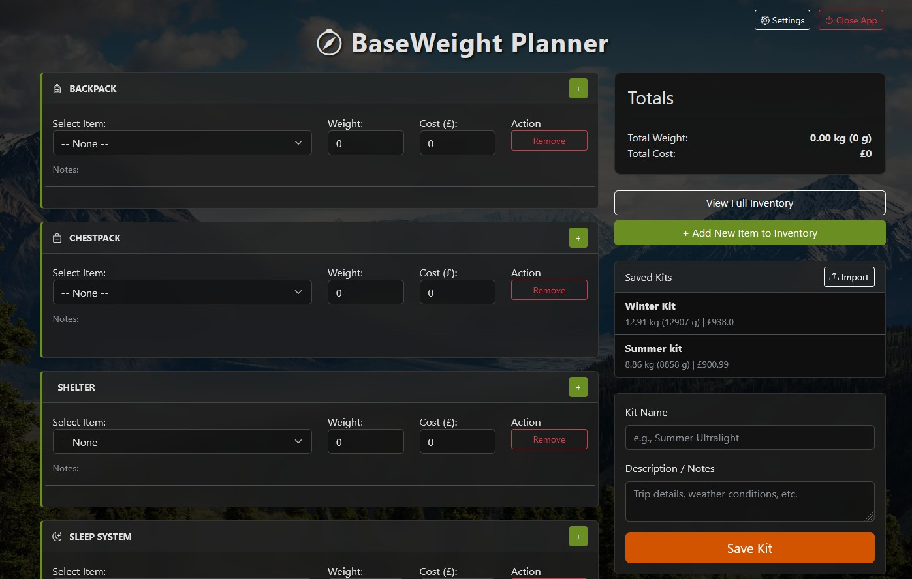
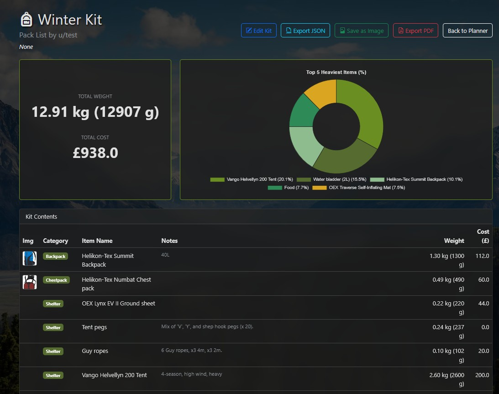
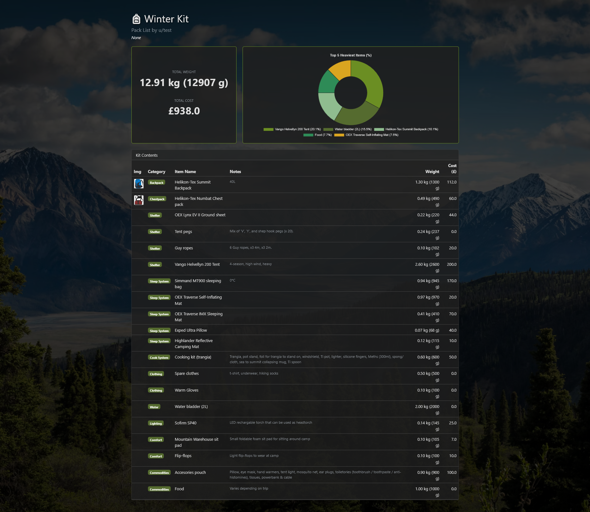
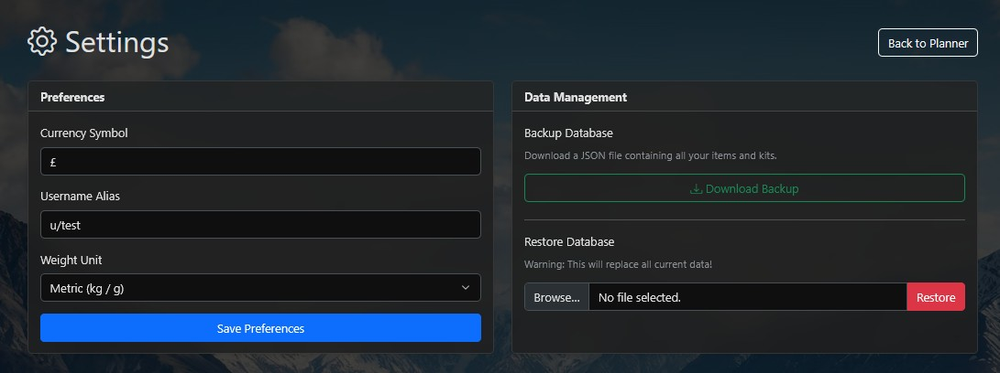

# BaseWeight - Hiking Gear Planner

BaseWeight is a desktop application designed to help hikers and backpackers plan their gear loadouts. It allows you to inventory your gear, create custom packing lists (kits), and visualize your pack weight and cost.

### Dashboard


### Saved Kit View


### Exported Kit Example


### Settings & Customization


## KEY FEATURES
* **Inventory Management:** Add gear with weight, cost, notes, and images.
* **Kit Planner:** Create custom kits from your inventory with drag-and-drop ease.
* **Visual Dashboard:** Real-time weight and cost calculation with pie charts.
* **Export Options:** 
  - **PDF:** Professional reports with charts and checklists.
  - **Image:** Save your kit summary as a PNG.
  - **JSON:** Share editable kit files with friends.
* **Customization:** Set your username alias, preferred currency symbol, and choose between Metric (kg/g) & Imperial (lbs/oz) units.
* **Data Management:** Backup your entire inventory and kits to a JSON file, and restore from it later.

## HOW TO RUN (Windows Executable)
1. Locate `BaseWeight.exe` in the folder.
2. Double-click to launch.
3. The application will automatically open in your default web browser.
4. To exit, click the "Close App" button in the top-right corner of the web page.

> **NOTE:** The application creates a `gear.db` file and an `uploads` folder in the same directory to save your data. Keep these if you move the program.

## HOW TO RUN (From Source Code)
**Prerequisites:** Python 3.10+

1. Install dependencies:
   ```bash
   pip install flask flask-sqlalchemy reportlab
   ```

2. Run the application:
   ```bash
   python app.py
   ```

3. Open your browser to the URL shown in the terminal (usually `http://127.0.0.1:xxxx`).

## SUPPORT
For issues or feature requests, please check the GitHub repository.

Happy Hiking!